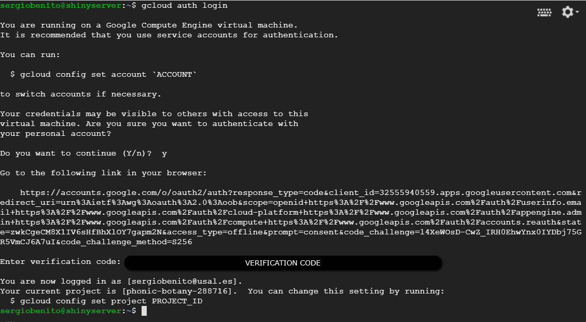
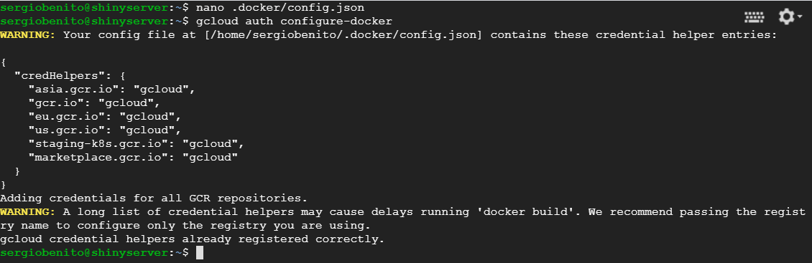
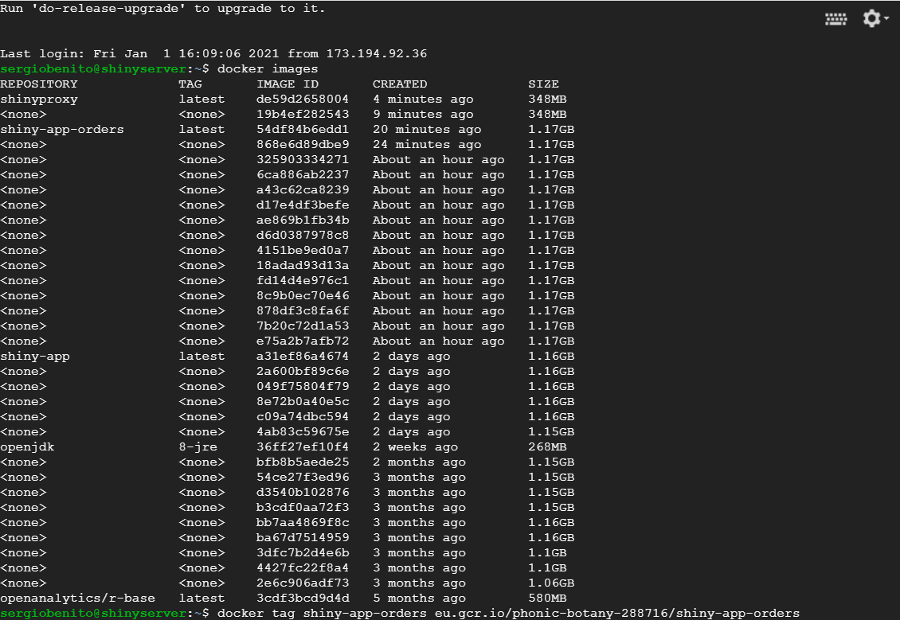
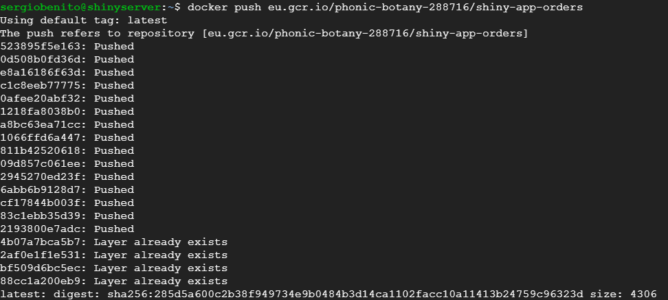
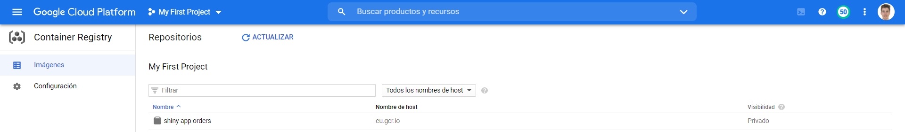

# Configure Container registry

Container Registry allow the user to have several images upload on the cloud in order to get them from specific pod with Docker.

At first, you have to go to your machine so that Docker has permissions in order to pull and push images to the service. Then, open the console and run the following commands:

```
gcloud auth login
```



```
gcloud auth configure-docker
```



After that, you can go to the machine in order to push the Shiny app image to *Container Registry* and tag the image with the registry name by using the command: `docker tag SOURCE_IMAGE HOSTNAME/PROJECT-ID/IMAGE` where:

+ `SOURCE_IMAGE`: local image name or image ID
+ `HOSTNAME`: specifies location where you will store the image, for European Union it has to be used `eu.gcr.io`
+ `PROJECT_ID`: GCP project name
+ `IMAGE`: name of the image

```
docker tag shiny-app-orders eu.gcr.io/phonic-botany-288716/shiny-app-orders
```



Then, you can push the image to *Container Registry*.

```
docker push eu.gcr.io/phonic-botany-288716/shiny-app-orders
```



Now, if everything was ok, the image should be shown in GCP Console inside Container Registry menu.


