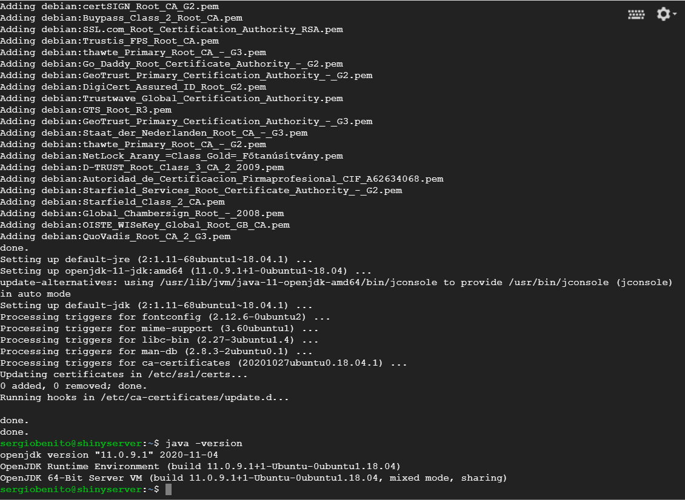
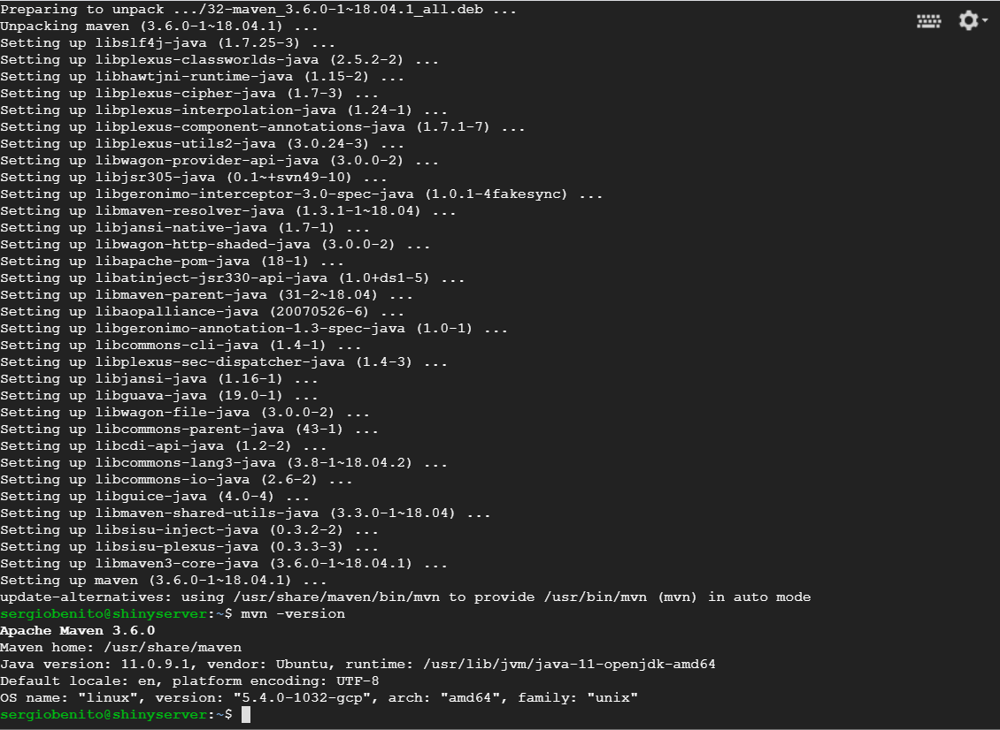

<h1>Config Shiny Server on VM Engine</h1>

<h2>Steps</h2>

- [1. Create a VM Machine in VM Engine](#1-create-a-vm-machine-in-vm-engine)
- [2. Set SSH keys in GitHub and clone repository](#2-set-ssh-keys-in-github-and-clone-repository)
- [3. Install Docker](#3-install-docker)
- [4. R Installation](#4-r-installation)
- [5. Docker](#5-docker)
- [6. Build Docker image](#6-build-docker-image)
- [7. Install Java](#7-install-java)
- [8. Install Maven](#8-install-maven)
- [9. ShinyProxy](#9-shinyproxy)
- [Config ShinyProxy](#config-shinyproxy)

## 1. Create a VM Machine in VM Engine

For this server it's used a Ubuntu machine v18.04 LTS with 2 CPUs and 2 GB of memory, besides its estimated cost is $13,85 in europe-west1 region, if machine was always on.

Then, install the main packages:

```
# update system packages and install the required packages
sudo apt-get update
sudo apt-get install bzip2 libxml2-dev libsm6 libxrender1 libfontconfig1 git
```

## 2. Set SSH keys in GitHub and clone repository

```
ssh-keygen -t rsa -b 4096 -C "youremail@email.com"
cat .ssh/id_rsa.pub
```

```
git config --global user.email "you@example.com"
git config --global user.name "Your Name"

# clone the project repo
git clone git@github.com:sergiobemar/tfg-sb-meal-delivery-prediction.git
```

## 3. Install Docker

To install Docker it's possible following [this tutorial](https://www.digitalocean.com/community/tutorials/como-instalar-y-usar-docker-en-ubuntu-18-04-1-es):

```
sudo apt install apt-transport-https ca-certificates curl software-properties-common

curl -fsSL https://download.docker.com/linux/ubuntu/gpg | sudo apt-key add -
sudo add-apt-repository "deb [arch=amd64] https://download.docker.com/linux/ubuntu bionic stable"
sudo apt update

apt-cache policy docker-ce
sudo apt install docker-ce

sudo systemctl status docker
```

Then, current user is added to *docker* group.

```
sudo usermod -aG docker ${USER}
su - ${USER}

# Check if it's added
id -nG
```

## 4. R Installation

In order to test the functionality before creating the container it's possible to test if the app runs using R, so the following code correspond with the commands which R can be installed.

```
# Add GPG Key
sudo apt-key adv --keyserver keyserver.ubuntu.com --recv-keys E298A3A825C0D65DFD57CBB651716619E084DAB9

# Add the R Repository
sudo add-apt-repository 'deb https://cloud.r-project.org/bin/linux/ubuntu bionic-cran40/'

# Update Package Lists
sudo apt update

# Install R
sudo apt install r-base

# Test install
sudo -i R
```

Also, for RShiny Sever installation, here are the steps:

```
sudo su - \
-c "R -e \"install.packages('shiny', repos='https://cran.rstudio.com/')\""

sudo apt-get install gdebi-core
wget https://download3.rstudio.org/ubuntu-14.04/x86_64/shiny-server-1.5.14.948-amd64.deb
sudo gdebi shiny-server-1.5.14.948-amd64.deb
```

## 5. Docker

Create a *Dockerfile* in current directory (where it's located *app.R*) with the following code:

```
FROM openanalytics/r-base

LABEL maintainer "Tobias Verbeke <tobias.verbeke@openanalytics.eu>"

# system libraries of general use
RUN apt-get update && apt-get install -y \
    sudo \
    pandoc \
    pandoc-citeproc \
    libcurl4-gnutls-dev \
    libcairo2-dev \
    libxt-dev \
    libssl-dev \
    libssh2-1-dev \
    libssl1.0.0

# system library dependency for the euler app
RUN apt-get update && apt-get install -y \
    libmpfr-dev

# basic shiny functionality
RUN R -e "install.packages(c('shiny', 'rmarkdown', 'remotes'), repos='https://cloud.r-project.org/')"

# install dependencies of the app
RUN R -e "install.packages(c('dplyr', 'data.table', 'plotly', 'purrr', 'lubridate', 'jsonlite', 'shiny', 'shinydashboard', 'DT', 'shinyWidgets', 'httr', 'shinyBS'), repos='https://cloud.r-project.org/')"

# install shinysky
RUN R -e "remotes::install_github('AnalytixWare/ShinySky')"

# copy the app to the image
RUN mkdir /root/app
COPY app /root/app

COPY Rprofile.site /usr/lib/R/etc/

EXPOSE 3838

CMD ["R", "-e", "shiny::runApp('/root/app')"]

```

## 6. Build Docker image

Now, from the main path, where is *Dockerfile*, you can run the following command in order to build the image of Shiny Server. The name *shiny-app* can be exchanged for another of our choice.

```
sudo docker build -t shiny-app .
```

Then, when the image is built, you can run now the docker container to deploy the ShinyApp.

```
sudo docker run -it -p 80:3838 shiny-app
```

With this command, you are setting that it was interactive and allocated a pseudo-TTY with ```-it``` and the port redirection ```-p [HOST PORT]:[CONTAINER PORT]```. At the end, it's set the name of the image, in this case *shiny-app*.

## 7. Install Java

In order to be able to use ShinyProxy, it's needed to have installed Java and Maven. At first, let's start with Java.

Use the following commands on the terminal to add Java repository to the system and then to install it.

```
sudo add-apt-repository ppa:linuxuprising/java

sudo apt-get update

sudo apt-get install default-jdk

```

When Java is installed, you can check it using the following command.
```
java -version
```

The result obtained should be such as this.



## 8. Install Maven

Maven is a necessary package for ShinyProxy, so let's install it.

```
sudo apt install maven
```

Once the installation is finished, check that everything was right.

```
mvn -version
```



## 9. ShinyProxy

Now, everything is ready to start to install ShinyProxy and configure it.

First, we need to clone the repository from *GitHub* and compile it using *Maven*.

```
git clone https://github.com/openanalytics/shinyproxy.git

cd shinyproxy/

mvn -U clean install
```

If everything was ok, a file such as *`target/shinyproxy-2.x.x.jar`* should exist.

## Config ShinyProxy

Now, we have to set the Shiny dashboard that it's created for the project as the application used by ShinyProxy, for be capable of making this configuration exists the file *`target/classes/application.yml`*. 

Edit it with the following configuration:

```

```

<h1>Useful links</h1>

+ [Crear imagen Docker con Shiny Server](https://www.analyticslane.com/2020/07/10/crear-imagen-docker-con-shiny-server/)
+ [Deploying an R Shiny App With Docker](https://www.r-bloggers.com/deploying-an-r-shiny-app-with-docker/)
+ [Dockerize a ShinyApp](https://juanitorduz.github.io/dockerize-a-shinyapp/)
+ [Download Shiny Server for Ubuntu 16.04 or later](https://rstudio.com/products/shiny/download-server/ubuntu/)
+ [GitHub - ShinyProxy Configuration Examples](https://github.com/openanalytics/shinyproxy-config-examples)
+ [GitHub - ShinyProxy Template](https://github.com/openanalytics/shinyproxy-template)
+ [How To Dockerize ShinyApps](https://www.statworx.com/de/blog/how-to-dockerize-shinyapps/)
+ [How To Install R on Ubuntu 18.04 Quickstart](https://www.digitalocean.com/community/tutorials/how-to-install-r-on-ubuntu-18-04-quickstart)
+ [Introduction to renv](https://rstudio.github.io/renv/articles/renv.html)
+ [ShinyProxy - Deploying Apps](https://www.shinyproxy.io/deploying-apps/)
+ [ShinyProxy - Meetup](https://github.com/karobotco/meetupcientificas)
+ [ShinyProxy - template](https://github.com/xmc811/ShinyProxy-template)